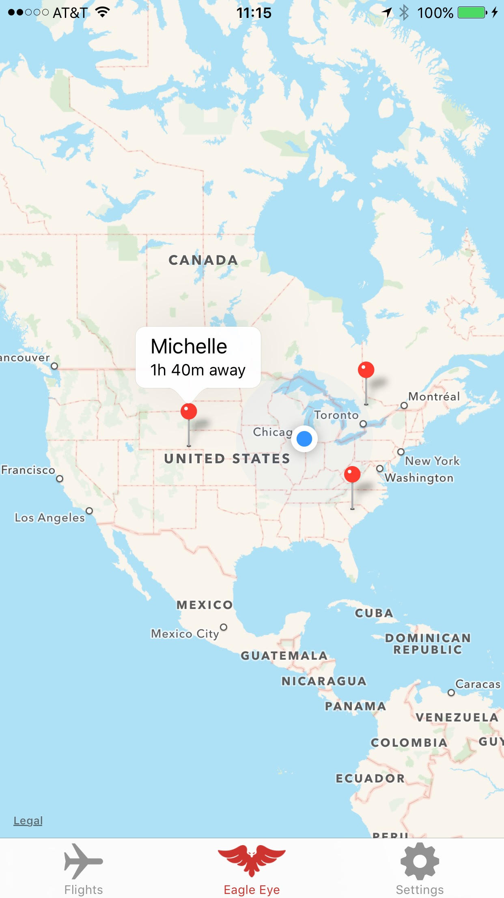
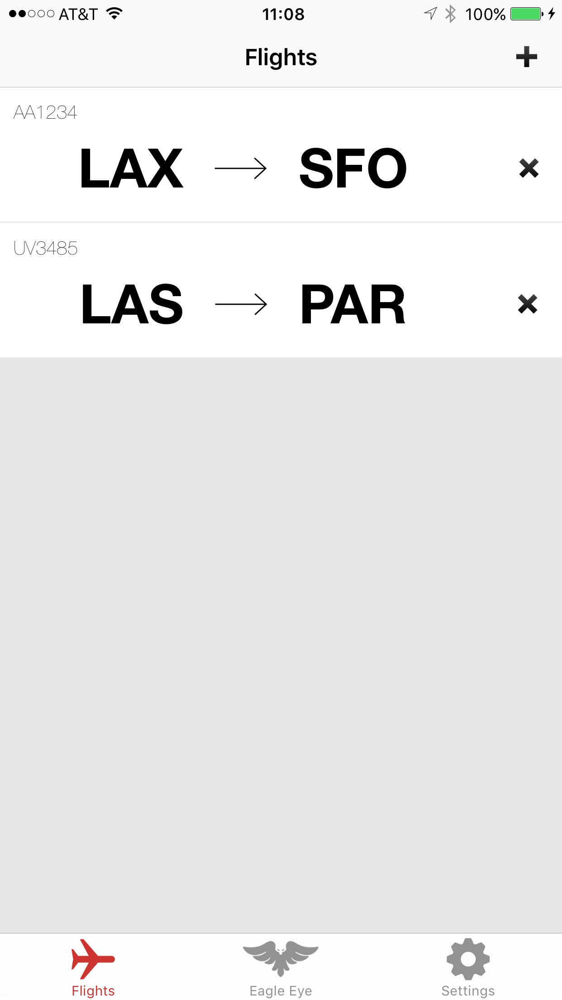

# EagleEye
Track the flights of your friends and family. Built with [React Native](https://facebook.github.io/react-native/).
**Devpost:** http://devpost.com/software/eagle-eye

# Screenshots

# Quickstart

- Open the `EagleEye` XCode project and run the app
- Start a local mongodb
- `npm start` in `eagle-server`

# Structure

- `EagleEye` - The iOS App
- `eagle-server` - The server backend

# Built with

## APIs/Services
- Azure App Service
- Azure Table Storage
- Twilio
- FlightRadar24

## Languages/Tech
- React Native
- Node
- Mongo

### FlightRadar24

An example query to flight radar: `http://data.flightradar24.com/zones/fcgi/feed.js?bounds=-24.7279948195948,-26.54105153955688,-55.23707285156206,-53.17657470703125`
